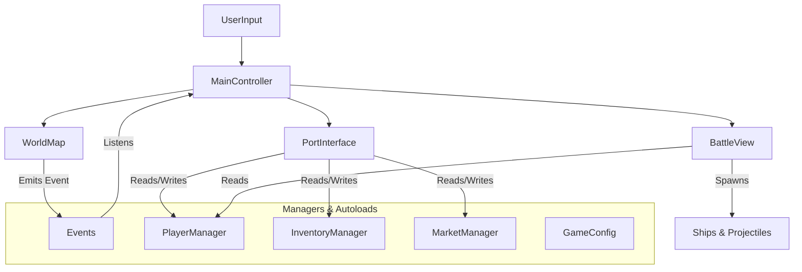

# Unknown Waters - System Design Document

This document breaks down the "Unknown Waters" project into distinct mechanics. Each section groups the relevant files, explains the core logic, and details how it connect to other systems. Use this as a guide for writing your course articles.

## 1. Core Architecture (The Spine)
**Concept**: The central nervous system of the game. It handles global communication and state management without tightly coupling components.

### Files Involved
- [scripts/autoloads/events.gd](file:///d:/gamedev/unknown-waters/scripts/autoloads/events.gd): **Global Event Bus**. The "radio station" of the game.
- [scripts/main_controller.gd](file:///d:/gamedev/unknown-waters/scripts/main_controller.gd): **Game Loop Coordinator**. Listens to radio signals and switches screens (Map vs Battle vs Port).
- [project.godot](file:///d:/gamedev/unknown-waters/project.godot): Registers Autoloads (Singletons).

### How it Works
1.  **Event Bus Pattern**: Instead of `BattleView` telling `MainController` "I am done", it just shouts `emit_signal("battle_ended")`. `MainController` hears this and decides what to do. This allows you to remove or replace `BattleView` without breaking `MainController`.
2.  **State Management**: `MainController` tracks the high-level state (`PORT`, `SAILING`, `BATTLE`).

### Teaching Angle
- Why Singletons/Autoloads are useful but dangerous.
- The Observer Pattern (Signals) for decoupling UI from Logic.

---

## 2. Economy & Trading System
**Concept**: The core loop of buying low and selling high.

### Files Involved
- [scripts/managers/market_manager.gd](file:///d:/gamedev/unknown-waters/scripts/managers/market_manager.gd): Logic for prices, random fluctuations, and transaction math.
- [scripts/managers/inventory_manager.gd](file:///d:/gamedev/unknown-waters/scripts/managers/inventory_manager.gd): Logic for player's cargo (Timber, Fish, etc.).
- [scripts/managers/player_manager.gd](file:///d:/gamedev/unknown-waters/scripts/managers/player_manager.gd): Holds the player's Gold.
- [scripts/port_interface.gd](file:///d:/gamedev/unknown-waters/scripts/port_interface.gd): The UI that displays this data.
- `resources/items/*.tres`: Data assets defining Items (Name, Base Price).

### Logic Flow
1.  **Price Generation**: On arrival at a port, `MarketManager.randomize_market_prices()` is called. It iterates all items and applies a random multiplier (0.7x to 1.4x).
2.  **Transactions**: When player clicks "Buy":
    - `MarketManager.calculate_transaction()` checks if Player has enough Gold and Space.
    - If valid, `PlayerManager` deducts Gold, and `InventoryManager` adds items.
    - `Events.emit_signal("transaction_completed")` updates the UI.

### Connections
- **Port Interface**: Strictly for display. It never changes data directly; it calls Manager functions.
- **Dependency**: Uses `ItemData` resources to know what items exist.

---

## 3. Navigation & World System
**Concept**: Moving the ship from Island A to Island B, triggered by player input.

### Files Involved
- [scripts/world_map.gd](file:///d:/gamedev/unknown-waters/scripts/world_map.gd): Handles visual movement, pathfinding, and click input.
- [scripts/resources/game_config.gd](file:///d:/gamedev/unknown-waters/scripts/resources/game_config.gd): Stores "Magic Numbers" like Ship Speed and Event Chance.
- [scenes/world_map.tscn](file:///d:/gamedev/unknown-waters/scenes/world_map.tscn): The visual layout of islands.

### Logic Flow
1.  **Movement**: Uses Godot's `NavigationAgent2D` (if enabled) or simple vector math (`position += direction * speed`).
2.  **Event System**: Every frame (in `_process`), a check runs: `if moving and random() < chance: trigger_event`.
3.  **Visuals**: Updates the `Ship` sprite rotation and position.

### Connections
- **MainController**: Listens for `reached_destination` to show the Port UI.
- **Events**: Emits `battle_started` or `storm_started` to pause movement and switch contexts.

---

## 4. Battle System
**Concept**: A mini-game triggered during travel. Uses distinct 2D entities.

### Files Involved
- [scripts/battle_view.gd](file:///d:/gamedev/unknown-waters/scripts/battle_view.gd): The arena manager. Spawns enemies, handles win/loss logic.
- [scripts/entities/player_ship.gd](file:///d:/gamedev/unknown-waters/scripts/entities/player_ship.gd): The player's combat avatar.
- [scripts/entities/enemy_ship.gd](file:///d:/gamedev/unknown-waters/scripts/entities/enemy_ship.gd): AI controlled opponents.
- [scripts/entities/projectile.gd](file:///d:/gamedev/unknown-waters/scripts/entities/projectile.gd): Bullets/Cannonballs.
- [scripts/resources/ship_data.gd](file:///d:/gamedev/unknown-waters/scripts/resources/ship_data.gd): Stats for ships (HP, Texture, Cannons).

### Logic Setup
1.  **Spawning**: `BattleView` reads `PlayerManager` to see what ship the player has, instantiates [player_ship.tscn](file:///d:/gamedev/unknown-waters/scenes/entities/player_ship.tscn), and configures it.
2.  **Enemy AI**: `EnemyShip` has a simple timer. When it reaches 0, it calls `emit_signal("shoot_requested")`.
3.  **Combat**: `BattleView` hears "shoot_requested" and spawns a `Projectile`.
4.  **Collision**: `Projectile` detects `area_entered`. If it hits an enemy/player, it calls `take_damage()`.

### Teaching Angle
- **Inheritance vs Composition**: Using `ShipData` (Resource) to define stats vs Code.
- **Object Pooling** (Advanced): How you *could* optimize projectile spawning.

---

## 5. Player Progression (Shipyard)
**Concept**: Upgrading the vessel to carry more cargo or survive longer.

### Files Involved
- [scripts/managers/player_manager.gd](file:///d:/gamedev/unknown-waters/scripts/managers/player_manager.gd): Stores `current_ship_data` (Stats) and `current_hull`.
- [scripts/port_interface.gd](file:///d:/gamedev/unknown-waters/scripts/port_interface.gd) (Shipyard Section): UI for repairing and buying.
- `resources/ships/*.tres`: Definitions of saleable ships (Sloop, Galleon).

### Logic Flow
1.  **Repair**: Calculates cost (`max_hull - current_hull * cost_per_point`). If affordable, resets hull to max.
2.  **Purchase**: Swaps the `current_ship_data` resource in `PlayerManager` with a new one.

---

## Summary of Relationships

